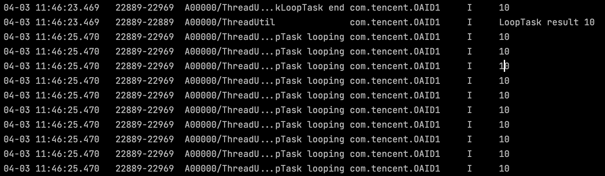
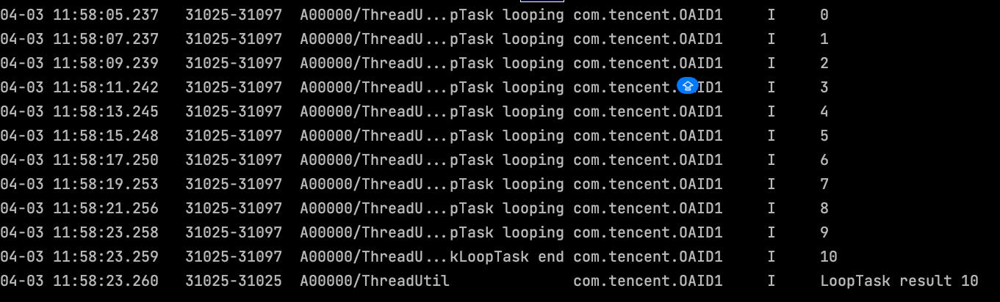

## setTime 函数
#### 函数原型：
```ts
/**
 * function:待执行函数
 * delay:延时delay毫秒后执行
 * args:待执行函数的参数
 */
setTimeout(function, delay, ...args);
```
#### 错误案例：
```ts
function mockLoopTask() {
  "use concurrent"
  let start = 0;
  while (start < 10) {
    setTimeout(() => {
      hilog.info(0x0000, 'ThreadUtil mockLoopTask looping', '%{public}d', start);
    }, 2000)
    start++;
  }
  return start;
}
```
// 输出结果：



可以看出，setTimeout 并没有按照既定顺序，每间隔2s打印一次数据。

原因：
setTime 是**异步执行**的，上面代码在调用 setTime 时并没有加任何锁同步，所有的while 循环都会走到 setTime并且等待2s，等待2s结束后几乎同时打印结果。
对 setTime 调用增加同步可以解决顺序执行的问题，对 setTime 进行封装。
#### 正确案例：
```ts
// DelayUtil.ets
export function delay11(ms: number): Promise<void> {
  return new Promise((resolve) => {
    setTimeout(resolve, ms);
  });
}

// MockTask.ets
async function mockLoopTask() {
  "use concurrent"
  let start = 0;
  hilog.info(0x0000, 'ThreadUtil mockLoopTask start', '%{public}d', '0');
  while (start < 10) {
    // 等待 delay 完成
    await delay11(2000);
    hilog.info(0x0000, 'ThreadUtil mockLoopTask looping', '%{public}d', start);
    // setTimeout(() => {
    //   hilog.info(0x0000, 'ThreadUtil mockLoopTask looping', '%{public}d', start);
    // }, 2000)
    start++;
  }
  hilog.info(0x0000, 'ThreadUtil mockLoopTask end', '%{public}d', start);
  return start;
}
```
// 输出结果



## this 关键字
箭头函数：(parameters) => { statements }

箭头函数和 this 联用时会存在陷阱。

箭头函数中不会创建自己的 this 上下文，而是捕获定义箭头函数时所在上下文中的 this，而
不是调用箭头函数时的上下文。

```ts
class Timer {
    timeout: number;

    constructor(timeout: number) {
        this.timeout = timeout;
    }

    // 使用传统函数
    startTraditional() {
        setTimeout(function() {
          // arkts 不允许这样写，必须使用箭头函数
            console.log(this.timeout); // `this` 会是 undefined 或指向全局/窗口对象，取决于严格模式
        }, 1000);
    }

    // 使用箭头函数
    startArrow() {
        setTimeout(() => {
            console.log(this.timeout); // `this` 正确地指向 Timer 实例（箭头函数定义时的上下文）
        }, 1000);
    }
}
```
